<!-- 🌟 Custom Animated Banner -->

 

<!-- ⌨️ Animated Typing Text -->

  😍 I'm a Developer crafting innovative solutions. 💻 Always learning and ready to collaborate on exciting projects!

 

<!-- 🏆 Trophies -->

  

  

## 🚀 About Me

  

    

      <strong>🌱 I'm currently diving deep into:</strong> 
      Python, PHP, SQL, C#, JavaScript, and CSS3
    

    

      <strong>💬 Ask me about:</strong> 
      JAVA, SQLSMS, and MongoDB
    

    

      <strong>⚡ Fun fact:</strong> 
      It's Cramming Time! 🤣
    

    
  

  

  

  

## 🔗 My Web Projects

  <a href="https://sanguiris.github.io/Pahimna/HOME.html" target="_blank" rel="noopener noreferrer">
    
    
  <a href="https://sanguiris.github.io/Pahimna/info.html" target="_blank" rel="noopener noreferrer">
    
    

  </a>

  

## 🤝 Connect with me:

  

  

  

  

  

  

  

  

  

## 🛠️ Languages and Tools:

  

  

  

  

  

  

  

  

  

  

  

  

  

  

## 📊 GitHub Stats

  <!-- ☀️/🌙 Streak Stats (auto theme switch) -->
  <picture>
    <source media="(prefers-color-scheme: dark)" srcset="https://streak-stats.demolab.com/?user=sanguiris&theme=github-dark&hide_border=true">
    
  </picture>

  

  <!-- ☀️/🌙 GitHub Stats (auto theme switch) -->
  <picture>
    <source media="(prefers-color-scheme: dark)" srcset="https://github-readme-stats-git-master-rickstaa.vercel.app/api?username=sanguiris&theme=github_dark&hide_border=true">
    
  </picture>
  <!-- ☀️/🌙 Top Languages (auto theme switch) -->
  <picture>
    <source media="(prefers-color-scheme: dark)" srcset="https://github-readme-stats-git-master-rickstaa.vercel.app/api/top-langs?username=sanguiris&theme=github_dark&hide_border=true">
    
  </picture>
  

  <!-- ☀️/🌙 Activity Graph (auto theme switch) -->
  <picture>
    <source media="(prefers-color-scheme: dark)" srcset="https://github-readme-activity-graph.vercel.app/graph?username=sanguiris&theme=github-dark">
    
  </picture>

  <!-- ☀️/🌙 Daily Quote (auto theme switch) -->
  <picture>
    <source media="(prefers-color-scheme: dark)" srcset="https://github-readme-quotes-bay.vercel.app/quote?theme=github-dark&layout=socrates">
    
  </picture>

  
<strong>👀 Profile Views</strong>

  

  
<strong>🐍 My Contribution Snake</strong>

  <!-- 🌗 Auto theme switch -->
  <picture>
    <source media="(prefers-color-scheme: dark)" srcset="https://raw.githubusercontent.com/sanguirIS/sanguirIS/output/github-snake-dark.svg">
    
  </picture>

  

## 🎬 YouTube Videos

  

  

 

<!-- 🌸 Footer -->

  

