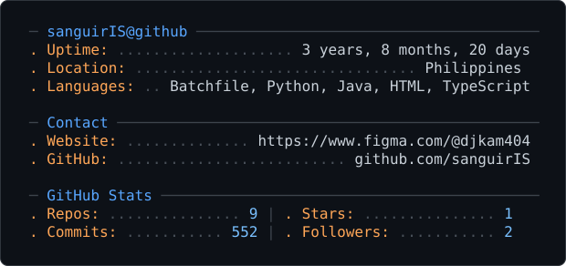

<!-- ════════════ BADGES ════════════ -->

  
  
  

<!-- ════════════ STATS · LANDSCAPE BOX (2×2 grid) ════════════
     NOTE: GitHub strips style="display:flex" from READMEs, so flex rows collapse into one tall
     stack. Tables + width/height attributes DO survive GitHub's sanitizer — that is the "box". -->

<table align="center" bgcolor="#282a36">
  <tr>
    <td width="50%" align="center" valign="top" bgcolor="#282a36">
      
        
      
    </td>
    <td width="50%" align="center" valign="top" bgcolor="#282a36">
      
        
      
    </td>
  </tr>
</table>

<!-- ════════════ CONTACT · KPAHIMNA GMAIL BADGE (custom icon, small, modern, toggled dark/light) ════════════ -->

  <a href="mailto:klenn31is18pahimna@gmail.com" target="_blank" rel="noopener noreferrer" style="text-decoration:none; display:inline-block;">
    <picture>
      <source media="(prefers-color-scheme: dark)" srcset="icons/gmail-kpahimna-dark.svg" />
      <source media="(prefers-color-scheme: light)" srcset="icons/gmail-kpahimna-light.svg" />
      
    </picture>
  </a>

<!-- ════════════ GITHUB METRICS ════════════ -->

  

<!-- ════════════ TYPING ANIMATION ════════════ -->

  

<!-- ════════════ PROJECTS (responsive cards) ════════════ -->

  

    <a href="https://pahimna.vercel.app" target="_blank" rel="noopener noreferrer" style="flex:1 1 300px; max-width:420px; text-decoration:none; color:#ffffff; background:#282a36; padding:20px 30px; border-radius:12px; border:1px solid #44475a; display:flex; align-items:center; gap:15px; transition:all 0.3s;">
      
      
        🏠 Home
        pahimna.vercel.app
      
    </a>
    <a href="https://pahimna.vercel.app/info.html" target="_blank" rel="noopener noreferrer" style="flex:1 1 300px; max-width:420px; text-decoration:none; color:#ffffff; background:#282a36; padding:20px 30px; border-radius:12px; border:1px solid #44475a; display:flex; align-items:center; gap:15px; transition:all 0.3s;">
      
      
        📁 Portfolio
        pahimna.vercel.app/info.html
      
    </a>
  

<!-- ════════════ SOCIALS · OWN CUSTOM ICONS (modern, small, auto dark/light toggle) ════════════ -->

  <a href="https://codepen.io/sanguiris" target="_blank" rel="noopener noreferrer" title="CodePen" style="display:inline-block;">
    <picture>
      <source media="(prefers-color-scheme: dark)" srcset="icons/codepen-dark.svg" />
      <source media="(prefers-color-scheme: light)" srcset="icons/codepen-light.svg" />
      
    </picture>
  </a>
  <a href="https://dev.to/sanguiris" target="_blank" rel="noopener noreferrer" title="Dev.to" style="display:inline-block;">
    <picture>
      <source media="(prefers-color-scheme: dark)" srcset="icons/devto-dark.svg" />
      <source media="(prefers-color-scheme: light)" srcset="icons/devto-light.svg" />
      
    </picture>
  </a>
  <a href="https://twitter.com/KPahimna" target="_blank" rel="noopener noreferrer" title="Twitter / X" style="display:inline-block;">
    <picture>
      <source media="(prefers-color-scheme: dark)" srcset="icons/x-dark.svg" />
      <source media="(prefers-color-scheme: light)" srcset="icons/x-light.svg" />
      
    </picture>
  </a>
  <a href="https://www.linkedin.com/in/djkam42pahimna" target="_blank" rel="noopener noreferrer" title="LinkedIn" style="display:inline-block;">
    <picture>
      <source media="(prefers-color-scheme: dark)" srcset="icons/linkedin-dark.svg" />
      <source media="(prefers-color-scheme: light)" srcset="icons/linkedin-light.svg" />
      
    </picture>
  </a>
  <a href="https://stackoverflow.com/users/21699471/klenn-pahimna" target="_blank" rel="noopener noreferrer" title="Stack Overflow" style="display:inline-block;">
    <picture>
      <source media="(prefers-color-scheme: dark)" srcset="icons/stackoverflow-dark.svg" />
      <source media="(prefers-color-scheme: light)" srcset="icons/stackoverflow-light.svg" />
      
    </picture>
  </a>
  <a href="https://www.youtube.com/@DEVKLENN" target="_blank" rel="noopener noreferrer" title="YouTube" style="display:inline-block;">
    <picture>
      <source media="(prefers-color-scheme: dark)" srcset="icons/youtube-dark.svg" />
      <source media="(prefers-color-scheme: light)" srcset="icons/youtube-light.svg" />
      
    </picture>
  </a>
  <a href="https://www.hackerrank.com/djkam42pahimna" target="_blank" rel="noopener noreferrer" title="HackerRank" style="display:inline-block;">
    <picture>
      <source media="(prefers-color-scheme: dark)" srcset="icons/hackerrank-dark.svg" />
      <source media="(prefers-color-scheme: light)" srcset="icons/hackerrank-light.svg" />
      
    </picture>
  </a>
  <a href="https://www.tiktok.com/@com4_4ksec" target="_blank" rel="noopener noreferrer" title="TikTok" style="display:inline-block;">
    <picture>
      <source media="(prefers-color-scheme: dark)" srcset="icons/tiktok-dark.svg" />
      <source media="(prefers-color-scheme: light)" srcset="icons/tiktok-light.svg" />
      
    </picture>
  </a>

<!-- ════════════ YOUTUBE · LANDSCAPE BOX (1×2, side-by-side) ════════════ -->

<table align="center" bgcolor="#282a36">
  <tr>
    <td width="50%" align="center" valign="top" bgcolor="#282a36">
      
    </td>
    <td width="50%" align="center" valign="top" bgcolor="#282a36">
      
    </td>
  </tr>
</table>

<!-- ════════════ PROFILE CARD · TOGGLED MODE (auto dark/light by system theme) ════════════ -->

  <picture>
    <source media="(prefers-color-scheme: dark)" srcset="dark_mode.svg" />
    <source media="(prefers-color-scheme: light)" srcset="light_mode.svg" />
    
  </picture>

